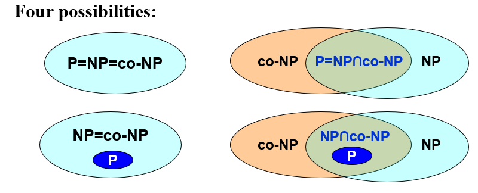

[TOC]

# 10 NP-Completeness 计算复杂性理论

### $P$ 多项式(polynomial)时间复杂度内可解问题

多项式时间复杂度包括$O(logN)$

$O(N)$是最简单的，因为起码要把答案看一遍

- 欧拉回路 Euler circuit problem

  https://blog.csdn.net/qq_37555704/article/details/83347641

  $O(E+V)$ 或$O(E^2)$ 每条边只扫到一次

- 最短路问题 Single-source unweighted shortest-path problem 迪杰斯特拉 $O(N^2)$ 

### $NP$ 多项式时间复杂度内不可解问题

- 找到一条**哈密尔顿回路 Hamilton cycle problem**

  > Find a single cycle that contains every vertex – does this simple circuit include all the vertices?
  > 由指定的起点前往指定的终点，途中经过所有其他节点且只经过一次。
  >
  > 闭合的哈密顿路径称作哈密顿回路 (Hamiltonian cycle)，含有图中所有顶点的路径称作哈密顿路径 (Hamiltonian path)

  $O(N!)$

  有没有哈密尔顿回路，不是NP问题

- 最长路问题 Single-source unweighted longest-path problem

### 图灵机 TURING MACHINE

> **(图灵) 停机问题 Halting problem**
> Is it possible to have your C compiler detect all infinite loops (死循环)? 
> 是否存在一个程序P，对于任意输入的程序w，能够判断w会在有限时间内结束或者[死循环]。

### NP类问题 Nondeterministic polynomial-time

<u>NP类问题是可以在多项式时间**（用确定性图灵机）验证**解的正确性的问题，用非确定型图灵机在多项式时间内解决的问题</u>

都是判定性问题。

所有的P类问题都是NP问题。也就是说，能多项式地解决一个问题，必然能多项式地验证一个问题的解

> Not all decidable problems are in NP.  
> 不是所有判定性问题都是NP问题，但所有NP问题都是可判定的
>
> 例如无哈密顿圈问题不是NP问题
> determining whether a graph **does not** have a Hamiltonian cycle.

### P类问题

<u>P类问题是可以**在多项式时间内用确定性算法**给出解的问题，即可以用**确定型图灵机在多项式时间内解**决</u>

是NP问题的子集  $P\subseteq NP$

$P=NP?$ **只要有一个NP问题等于P，则NP=P**

### NP-Hard问题

所有NP类问题可在多项式时间内规约为该问题。

- 下一章的==Bin Packing==

### NP-Complete 

Non-deterministic Polynomial Complete

即NPC问题是最难的NP问题

1. <u>是NP问题</u>

2. <u>所有的NP问题都可以在**多项式**时间内约化到它（是NPH问题）</u>

解决一个NPC问题就可以解决所有NP问题

**规约(Reducibility 约化)**

> 如果能找到这样一个变化法则，对任意一个程序A的输入，都能按这个法则变换成程序B的输入，使两程序的输出相同，那么我们说，问题A可约化为问题B。  $A \leqslant _P B$
>
> 问题A可约化为问题B说明：B的时间复杂度高于或者等于A的时间复杂度
>
> 约化具有传递性。如果问题A可约化为问题B，问题B可约化为问题C，则问题A一定可约化为问题C

下列五个问题是NPC问题

- **Hamilton回路问题的求解版本**可以约化为**TSP问题 (Travelling Salesman Problem，旅行商问题)**  判定版本为P
  在Hamilton回路问题中，两点相连即这两点距离为0，两点不直接相连则令其距离为1，于是问题转化为在TSP问题中，是否存在一条长为0的路径。Hamilton回路存在当且仅当TSP问题中存在长为0的回路。

  > <u>TSP问题</u>：旅行商要到若干个城市旅行，各城市之间的费用是已知的，为了节省费用，旅行商决定从所在城市出发，到每个城市旅行一次后返回初始城市，问他应选择什么样的路线才能使所走的总费用最短？（包含所有节点的基础上让费用最少）
  >
  > Given a complete graph G=(V, E), with edge costs, and an integer K, is there a simple cycle that visits all vertices and has total cost $\leqslant K$?

- **TSP的判定版本为NPC, 求解的版本是NPH**

- **SAT问题 (布尔可满足性问题，命题可满足性问题，Satisfiability problem，Circuit-SAT)**

  第一个NPC问题，证明不需要知道

  > <u>SAT问题</u>：询问给定布尔公式的变量是否可以一致地用值TRUE或FALSE替换，使公式计算结果为TRUE（有很多个集合，每个集合里面有若干元素，现给出一些取元素的规则，要你判断是否可行，可行则给出一个可行方案。如果所有集合中，元素个数最多的集合有k个，那么我们就说这是一个k-sat问题）
  >
  > Input a boolean expression and ask if it has an assignment to the variables that gives the expression a value of 1

- **Clique** **problem**（是否存在至少有k个顶点的完全子图)

- **Vertex cover problem**(存在至少k个顶点的子图，使得原图中每条边至少有一个顶点在子图中(即覆盖了所有的边)。 可以用local search求解, 确认算法的复杂度是$O(N^3)$。 如果图是树那就是P问题了

- **0-1背包问题**

**halting problem不是NP问题，是无解的**

### Formal-language Framework

**抽象问题 Abstract Problem**

An abstract problem $Q$ is a binary relation on a set $I$ of problem **instances** and a set $S$ of problem **solutions**.

最优问题转化为判定性问题（所有优化问题都能转化为判定问题），解空间变为 $\{0,1\}$

**Formal-language Theory**

|                         |                                                              |
| ----------------------- | ------------------------------------------------------------ |
| 字母表 alphabet         | a finite set of symbols  $\{ 0, 1 \}$                        |
| language                | $L$ over $Σ$ is any set of strings made up of symbols from $Σ$   $L = \{ x ∈ Σ^*: Q(x) = 1 \}$ |
| **empty string**        | $ε$                                                          |
| **empty language**      | $Ø$                                                          |
| Language of all strings | over Σ is denoted by $Σ^*$                                   |
| 补集                    | The **complement** of L is denoted by $Σ^*-L$                |

**判定**

|      |                                                              |
| ---- | ------------------------------------------------------------ |
| 接受 | Algorithm $A$ **accepts** a string $x ∈ \{0, 1\}^*$ if $A(x) = 1$ |
| 拒绝 | Algorithm $A$ **rejects** a string x if $A(x) = 0$           |
| 判定 | A language $L$ is **decided** by an algorithm $A$ if every binary string in $L$ is accepted by $A$ and every binary string not in $L$ is rejected by $A$ |

To **accept** a language, an algorithm need only worry about strings in $L$, but to **decide** a language, it must correctly accept or reject every string in $\{0, 1\}^*$

> $P = \{ L ⊆ \{0, 1\}^* : \mathrm{there\ exists\ an\ algorithm\ }A\mathrm{\ that\ decides\ }L\ \mathrm{in\ polynomial\ time} \} $

**验证算法 verification algorithm**

- A **verification algorithm** is a two-argument algorithm $A$, where one argument is an ordinary input string $x$ and the other is a binary string  $y$ called a **certificate**. 证书

- 验证 A two-argument algorithm $A$ **verifies** an input string $x$ if there exists a certificate y such that $A(x, y) = 1$. 

- The language verified by a verification algorithm $A$ is  

  $L = { x ∈ \{0, 1\}^* : \mathrm{there\ exists\ }y ∈ \{0, 1\}^*\mathrm{\ such\ that}\ A(x, y) = 1}$.

  

  > A language $L$ belongs to **NP** iff there exist a two-input polynomial-time algorithm $A$ and a constant $c$ such that $L = \{ x ∈ \{0, 1\}^* : \mathrm{there\ exists\ a\ certificate}\ y\  \mathrm{with}\ |y| = O(|x|c)\ \mathrm{such\ that}\ A(x, y) = 1 \}$ We say that algorithm A **verifies** language L in polynomial time.

#### 补问题

the set of languages $L$ such that $\overline L \in NP$

**co-NP问题是补属于NP问题的问题，NP类问题的补集**

NP类问题对于no的回答并不要求找到一个易于验证的证据，当一类问题能够为no的回答找到易于验证的证据，就称为co-NP问题

**约化算法 reduction algorithm**

- A language $L_1$ is **polynomial-time reducible** to a language $L2 ( L1 \leqslant _P L2 )$ if there exists a polynomial-time computable function  $f : \{0, 1\}^* → \{0,1\}^*$ such that for all $x \{0, 1\}^*,  x \in L_1$  iff  $f (x) \in L_2$.

- We call the function $f$ the **reduction function**, and a polynomial-time algorithm $F$ that computes  $f$  is called a **reduction algorithm**.

  > A language $L ⊆ \{0, 1\}^*$ is **NP-complete** if
  >
  > 1. $L \in NP$, and
  > 2. $L' \leqslant_P L$ for every $L’ ∈ NP$.

